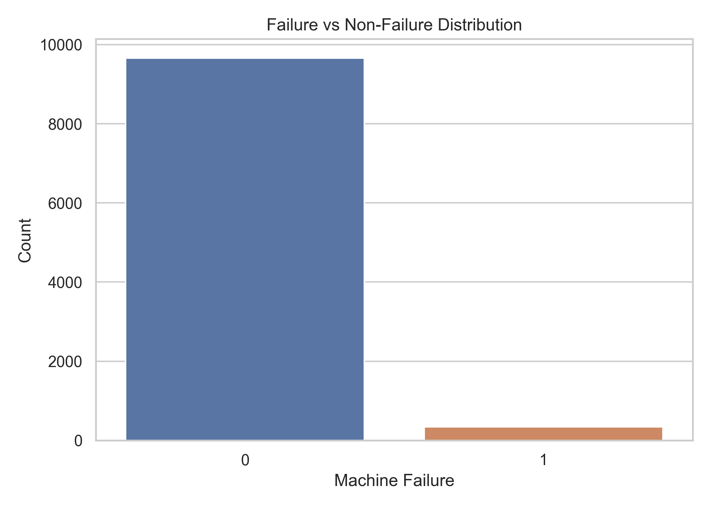
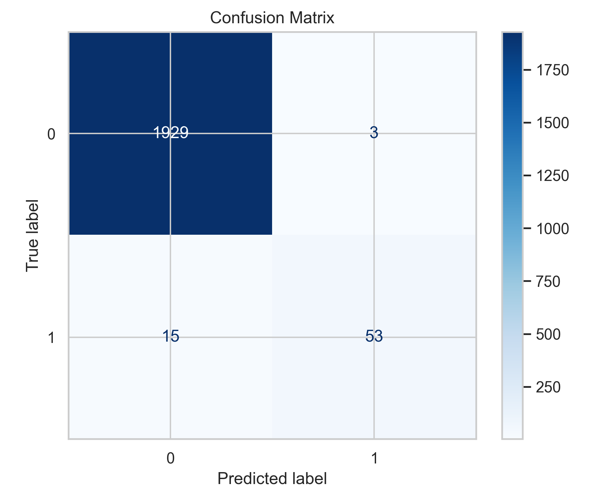
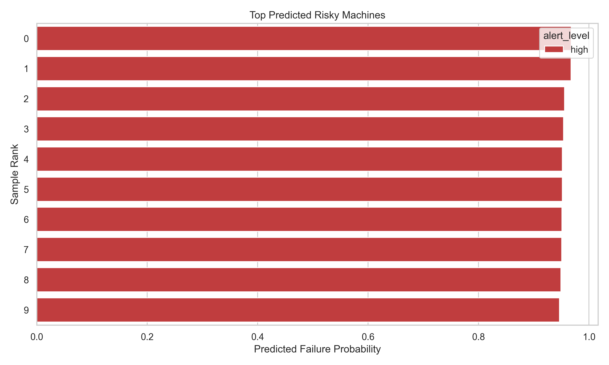

# AI-Powered Predictive Maintenance System for IoT Devices

An industry-oriented beginner project that simulates IoT-based predictive maintenance using a public manufacturing dataset, machine learning classification, alert generation, and visual analytics.

## Why this project matters

Industries such as manufacturing, power, automotive, and aviation depend on machines that are expensive to stop, repair, or replace. Predictive maintenance helps companies identify early warning signs of failure from sensor readings like temperature, rotational speed, torque, and tool wear. Instead of waiting for a machine to break, teams can plan maintenance before downtime happens.

This repository uses the UCI `AI4I 2020 Predictive Maintenance Dataset` as a virtual IoT data source. It is a strong student-friendly choice because it looks realistic, is easy to explain in interviews, and can be executed on a normal laptop without industrial hardware.

## Project workflow

1. Load a manufacturing sensor dataset.
2. Clean and normalize column names.
3. Engineer practical condition-monitoring features.
4. Train baseline classification models.
5. Predict whether a machine is likely to fail.
6. Generate risk-based maintenance alerts.
7. Save evaluation reports and visual proof assets.

## Tech stack

- Python 3.11+ recommended
- Pandas, NumPy
- Scikit-learn
- Matplotlib, Seaborn
- Joblib
- `ucimlrepo` for downloading the UCI dataset

## Folder structure

```text
AI-Predictive-Maintenance-IoT/
├── data/
│   ├── raw/
│   └── processed/
├── docs/
├── images/
├── models/
├── notebooks/
├── outputs/
│   ├── figures/
│   └── reports/
├── src/
├── .gitignore
├── main.py
├── README.md
└── requirements.txt
```

## Dataset

- Recommended dataset: UCI AI4I 2020 Predictive Maintenance Dataset
- Official source: [UCI repository](https://archive.ics.uci.edu/dataset/601/ai4i)
- Dataset style: industrial sensor snapshots that can be treated like virtual IoT telemetry

Important modeling note:
The dataset includes failure-mode columns such as `TWF`, `HDF`, `PWF`, `OSF`, and `RNF`. These directly reveal the target label, so the project drops them to avoid leakage and keep the model realistic.

## Installation

### Windows

```powershell
cd D:\AI-Predictive-Maintenance-IoT
python -m venv .venv
.\.venv\Scripts\activate
pip install -r requirements.txt
```

### Mac/Linux

```bash
cd /path/to/AI-Predictive-Maintenance-IoT
python3 -m venv .venv
source .venv/bin/activate
pip install -r requirements.txt
```

## Run the full pipeline

```bash
python main.py --mode full --threshold 0.45
```

## Expected outputs

After running the project, you should see:

- `outputs/reports/dataset_preview.csv`
- `outputs/reports/preprocessing_summary.txt`
- `models/predictive_maintenance_model.joblib`
- `data/raw/ai4i2020.csv`
- `data/processed/processed_ai4i2020.csv`
- `outputs/reports/metrics.json`
- `outputs/reports/test_predictions.csv`
- `outputs/reports/top_alerts.csv`
- `outputs/reports/summary.txt`
- `outputs/figures/failure_distribution.png`
- `outputs/figures/confusion_matrix.png`
- `outputs/figures/failure_probability_distribution.png`
- `outputs/figures/top_risky_machines.png`

## Verified sample results

This repository was validated locally with the full pipeline command on April 10, 2026.

- Selected model: `random_forest`
- Accuracy: `0.991`
- Precision: `0.9464`
- Recall: `0.7794`
- ROC-AUC: `0.9862`

These numbers can vary slightly across environments, but they show the project is working end to end.

## Suggested screenshots for GitHub

Use these repository files directly in your README:





## GitHub proof strategy

- Commit project setup first
- Commit dataset loading and preprocessing next
- Commit model training and evaluation separately
- Commit visuals and README polish last
- Add screenshots from the `outputs/figures/` folder to the repository and README

## Interview talking points

- Why predictive maintenance is better than reactive maintenance
- Why removing leakage columns matters in machine learning
- Why class imbalance matters for failure prediction
- Why recall is important when missed failures are costly
- How sensor data can be simulated from public datasets when hardware is unavailable

## Extended guide

For the complete beginner-friendly project explanation, architecture, implementation phases, GitHub plan, proof checklist, and portfolio guidance, see:

- [Student project guide](docs/student_project_guide.md)
- [GitHub proof plan](docs/github_proof_plan.md)
